# Previsione della produzione di energia fotovoltaica

Modello end-to-end per prevedere la potenza di un impianto PV a partire da dati meteo (temperatura, umidità, vento, pioggia, nuvolosità) e radiazione solare (Dhi, Dni, Ghi). La pipeline pulisce i dati, li riallinea in un fuso fisso, applica encoding ciclico e feature fisiche, quindi prepara gli split temporali e i DataLoader PyTorch.

**Obiettivi del progetto:**
- Legare variabili meteorologiche e radiazione solare alla produzione PV.
- Pulire dati (missing, outlier, categorie rare) in modo deterministico.
- Sviluppare e confrontare modelli di previsione su split temporali robusti.
- Fornire feature fisiche interpretabili riutilizzabili in altri modelli.

## Struttura dei file
- `main.py`: entrypoint della pipeline; orchestra caricamento, EDA, preprocessing, split temporali, OHE, feature engineering, scaling, standardizzazione della `y`, DataLoader e training TCN con plot delle loss.
- `src/config.py`: tutte le configurazioni (percorsi dati, split, `PVDataConfig`, batch/num_workers, scaler mode, hyperparam modello, training params, path plot loss).
- `src/data_upload.py`: lettura dei file Excel grezzi (`data/wx_dataset.xlsx`, `data/pv_dataset.xlsx`) con gestione dei fogli e check sull'engine `openpyxl`.
- `src/EDA.py`: stampe di controllo e generazione dei plot EDA (`eda_plots/*.png` e `numeric_stats.csv`).
- `src/preprocessing.py`: imputazione `rain_1h`, estrazione/rimozione di lat/lon, fix timezone (UTC+10), encoding ciclico ora/mese, allineamento X-y, OHE con vocabolario fisso e scaler standard/minmax fittati sul solo train.
- `src/feature_engineering.py`: feature fisiche (angoli solari, clearness index, effective irradiance, cloud_effect, minuti da/alba/tramonto) e salvataggio delle matrici con feature.
- `src/data_module.py`: split temporali (holdout o CV), dataset a finestre per serie storiche (`history_hours`/`horizon_hours`), aggiunta del contesto al validation e DataLoader PyTorch; supporta anche l'inclusione della y passata tra le feature del modello.
- `requirements.txt`: dipendenze minime per eseguire pipeline, plot e PyTorch.
- `data/processed/*.csv`: output intermedi (dopo preprocessing e feature engineering) salvati dal main.
- `eda_plots/*.png`, `eda_plots/numeric_stats.csv`: grafici e statistiche descrittive prodotte dall'EDA.

## Come gira la pipeline (main.py)
1. Carica X grezze meteo e y PV (`load_datasets`), estrae lat/lon.
2. Esegue EDA base e salva i plot in `eda_plots/`.
3. Preprocessing deterministico (`preprocess_pipeline`): imputazioni, timezone fisso, encoding ciclico, allineamento, cast a `float32`.
4. Split temporale coerente (holdout o CV) senza leakage.
5. Fit OHE solo su train e applicazione a val/test.
6. Feature engineering fisico (angoli solari, effective irradiance, cloud effect, timing solare) e scaling opzionale.
7. Standardizza la `y` (mean/std calcolati sul solo train di ogni fold) per stabilizzare il training.
8. Per il validation aggiunge un contesto storico (ultime `history_hours` del train) così le finestre non partono "a vuoto".
9. Salva i dataset con feature (`data/processed/X_*_feat.csv`) e costruisce i DataLoader per il training PyTorch includendo, se configurato, la `y` passata dentro `x_hist`.
9. Allena un TCN multi-step (horizon configurabile) con MSE, log delle loss train/val e plot salvato (`cfg.LOSS_PLOT_PATH`, default `eda_plots/loss_curve.png`); valuta sul test riportando MSE/RMSE in scala originale.

## Analisi Esplorativa dei Dati (EDA)
L’EDA controlla qualità e distribuzioni delle variabili meteo e della label PV usando statistiche descrittive, istogrammi, heatmap di correlazione e boxplot per categorie. I grafici sono salvati in `eda_plots/` e riepilogati qui sotto.

### Risultati sintetici EDA
- Missing: solo `rain_1h` ha vuoti rilevanti (~79%); le etichette PV non hanno missing → imputazione a 0.
- Correlazioni con `kwp`: `Ghi` domina (≈0.95), seguono `Dni` (≈0.79) e `Dhi` (≈0.66); umidità/temperatura intorno a 0.43.
- Categorie meteo: poche classi principali (`sky is clear`, `light rain`, `overcast clouds`) e molte rare → OHE con bucket `other`.
- Analisi temporale: picchi PV nelle ore centrali, coerenti con il fuso fisso e con i picchi di irraggiamento.

### Galleria EDA (estratto)
- 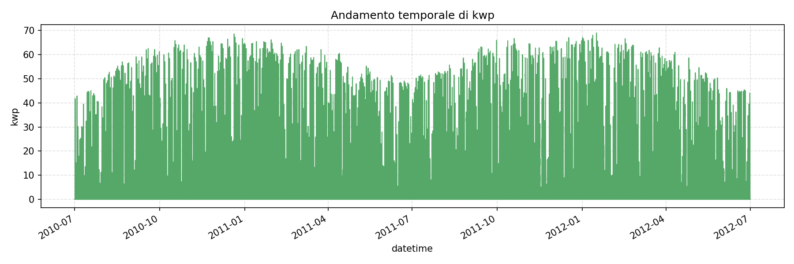 Andamento temporale stabile, conferma il riallineamento in UTC+10.
- 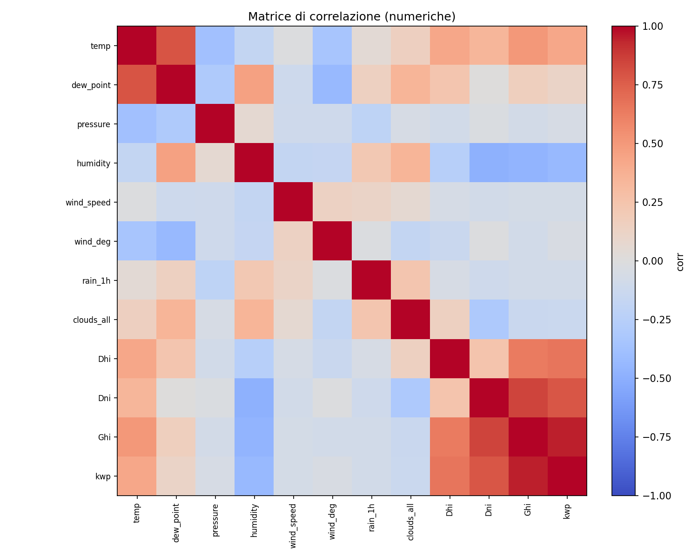 Le componenti radiative spiccano; pressione e umidità sono secondarie.
- 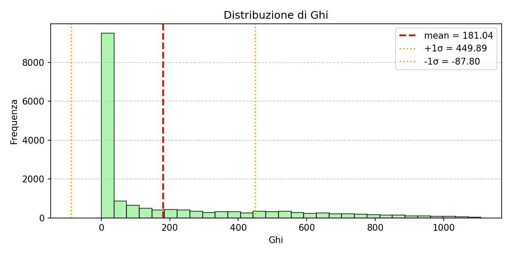 Coda destra pronunciata → utile il clipping outlier.
- 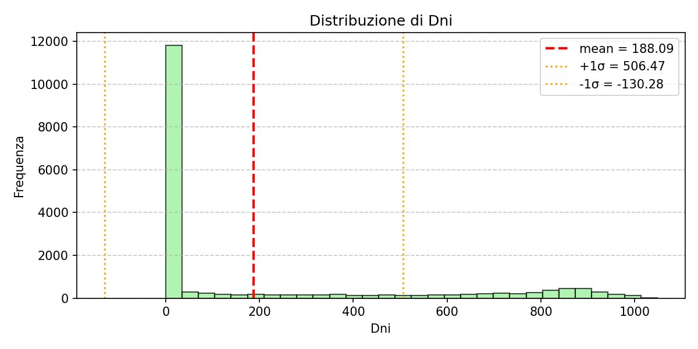 Varianza alta della componente diretta, motivazione per combinare con lo zenith.
- 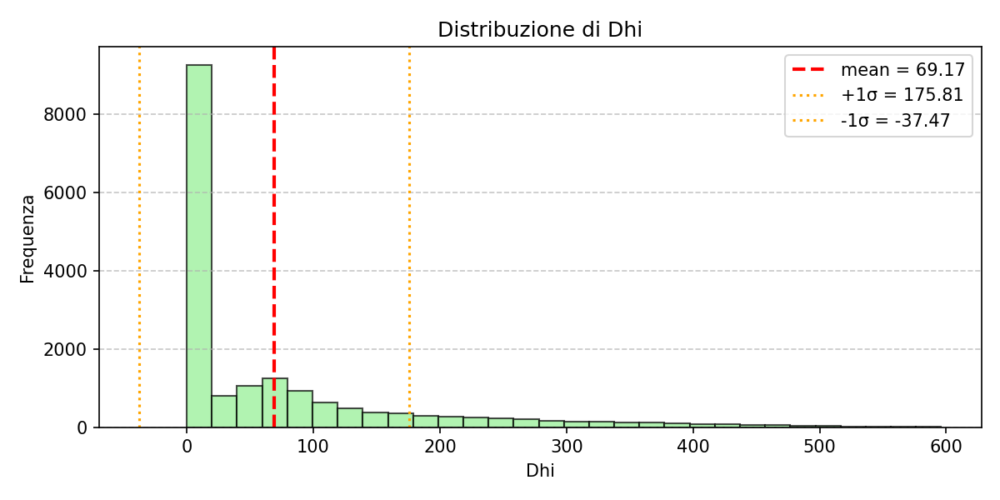 Valori compatti per la quota diffusa, base per `direct_fraction`.
- 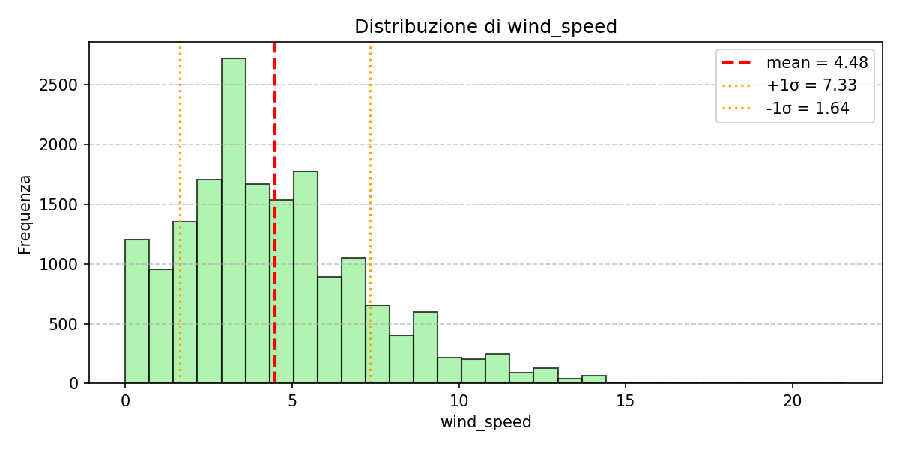 Distribuzione stretta intorno a valori moderati; impatto limitato ma stabile sul modello.
- 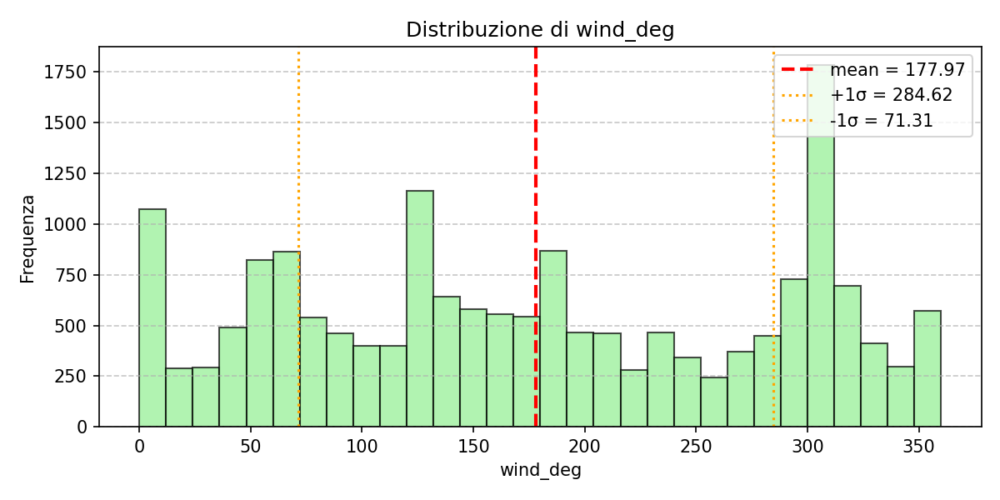 Pattern quasi uniforme → conviene lasciarla come variabile continua.
-  Distribuzione stretta, buon candidato per scaling standard.
- 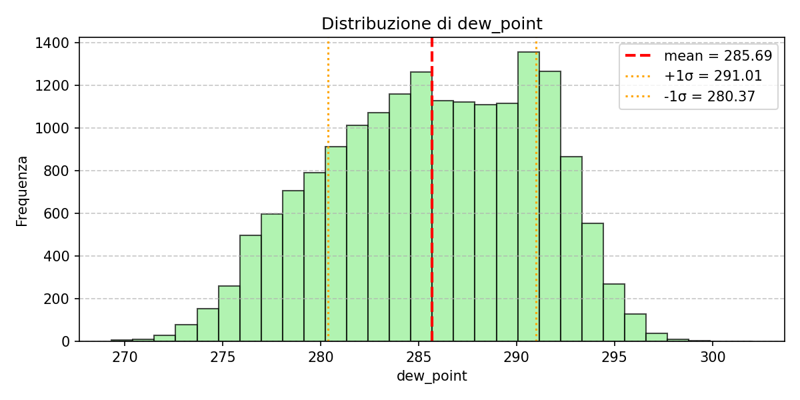 Trend quasi gaussiano che segue l’umidità, utile per capire condizioni di condensa.
- 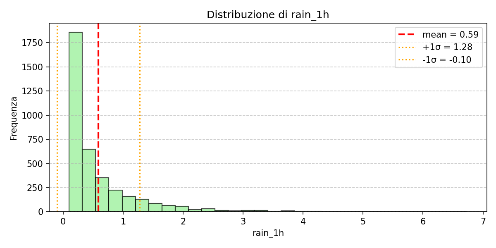 Dominata dagli zeri; l’imputazione a 0 non introduce rumore.
- 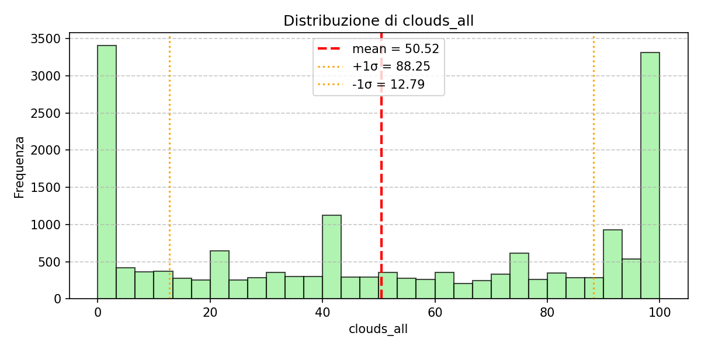 Distribuzione quasi uniforme → `cloud_effect` come attenuazione continua.
- 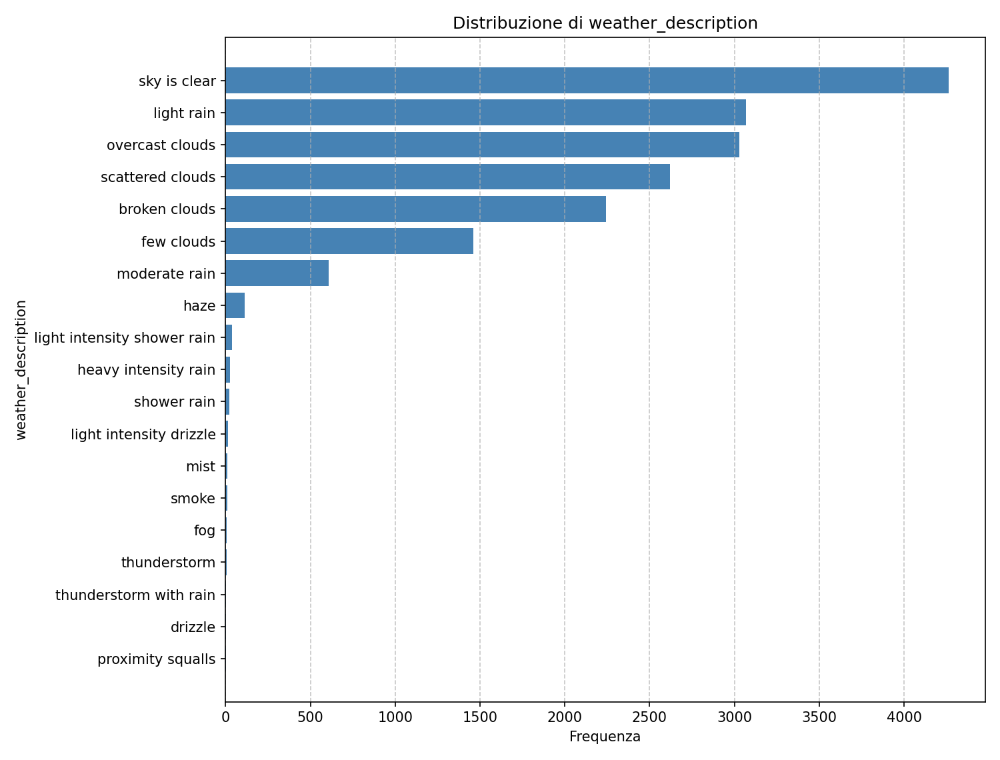 e 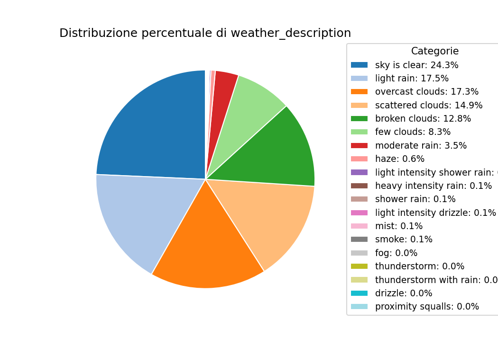 Poche classi prevalenti, molte rare: giustifica il bucket `other`.

### Analisi temporale avanzata (eda_plots/temporal)
Questi grafici servono per capire struttura, stagionalita e dipendenze della serie PV, e quindi guidare la scelta del modello e della finestra storica.

-  Media oraria della produzione: curva a campana con minimi notturni e picco nelle ore centrali. La pendenza di salita/discesa indica l'asimmetria mattino/pomeriggio e conferma che il segnale e dominato dal ciclo diurno → suggerisce modelli che catturano pattern intraday e finestre storiche che coprano un intero giorno.
-  Scomposizione in trend, stagionale e residuo: il trend mostra variazioni lente (stagioni o degradazione), la componente stagionale evidenzia oscillazioni regolari, il residuo mostra rumore e eventi improvvisi (nubi) → motiva feature di calendario/cicliche e modelli capaci di separare trend da stagionalita.
-  L'ACF evidenzia memoria a lag brevi e risonanze a 24h/48h; la PACF mostra i lag realmente informativi una volta tolta la dipendenza indiretta → aiuta a scegliere `history_hours`, il numero di lags utili e supporta modelli sequence-based (TCN/LSTM).
-  L'energia e concentrata su frequenze giornaliere (e secondariamente settimanali), con armoniche che descrivono la forma non sinusoidale del profilo PV → conferma periodicita, giustifica encoding ciclico e modelli con capacita di catturare componenti periodiche multiple.

In sintesi: la forte periodicita e l'autocorrelazione suggeriscono modelli temporali con memoria (TCN) e una finestra storica che copra almeno il ciclo giornaliero; la stagionalita piu lenta giustifica feature di calendario e split temporali rigorosi per evitare leakage.

# Ciclical Encoding
Per rendere il tempo digeribile dal modello:
- **Rimozione dell'Ora Legale (DST)**: conversione di tutti i timestamp in fuso fisso UTC+10 e arrotondamento all’ora → niente salti artificiali tra 12:00 e 13:00.
- **Encoding ciclico (sin/cos)**: ora (0-23) e mese (1-12) trasformati su cerchio per preservare la continuità (23 è vicino a 0).

## Feature engineering
Feature fisiche aggiunte per migliorare le prestazioni senza usare il tilt reale del pannello.

### Solar features
| Feature           | Descrizione |
| ----------------- | ----------- |
| `solar_zenith`    | Angolo zenitale (90° = sole allo zenit), influenza la radiazione incidente. |
| `solar_azimuth`   | Direzione del sole (0° Nord, 180° Sud), distingue mattino/pomeriggio. |
| `clearness_index` | Rapporto tra GHI reale ed ETR (extraterrestrial irradiance), misura la limpidezza del cielo. |

### Effective irradiance
| Feature                | Formula                   | Significato |
| ---------------------- | ------------------------- | ----------- |
| `effective_irradiance` | `DNI * cos(zenith) + DHI` | Stima dell’energia effettivamente utile al pannello. |
| `direct_fraction`      | `DNI / (DNI + DHI)`       | Indica se prevale radiazione diretta o diffusa. |
| `clear_sky_index`      | `GHI / GHI_clear`         | Quanto la condizione reale differisce dal cielo ideale. |

### 🌤 Atmospheric & temporal features
| Feature                  | Formula / Definizione | Significato |
| ------------------------ | --------------------- | ------------ |
| `cloud_effect`           | `GHI * (1 - clouds_all/100)` | Radiazione attesa dopo l’attenuazione delle nubi (proxy dello shading atmosferico). |
| `minutes_since_sunrise`  | differenza tra ora attuale e alba stimata | Indica l’avanzamento della giornata solare. |
| `minutes_until_sunset`   | differenza tra tramonto stimato e ora attuale | Quanta parte della giornata solare rimane. |

### Osservazioni
- Le feature sono combinazioni non lineari di variabili fisiche → aggiungono informazione, non rumore.
- `effective_irradiance`, `direct_fraction` e `clear_sky_index` descrivono lo stato radiativo senza tilt.
- `cloud_effect` ingloba la copertura nuvolosa come attenuazione continua.
- `minutes_since_sunrise` e `minutes_until_sunset` modellano la fase del giorno, tra le feature più predittive per la curva PV.

## Output del preprocessing
- Dataset con feature: `data/processed/X_feat.csv` (o `X_*_feat.csv` per train/val/test).
- Target: `data/processed/y_processed.csv`.

## Note su data_module (modifiche recenti)
- **Context nel validation**: quando si costruiscono i set di val, si premettono le ultime `history_hours` del train a `X_val` e `y_val` (funzione `make_val_with_context`). Questo evita finestre iniziali senza storia e rende la validazione coerente con la dinamica autoregressiva.