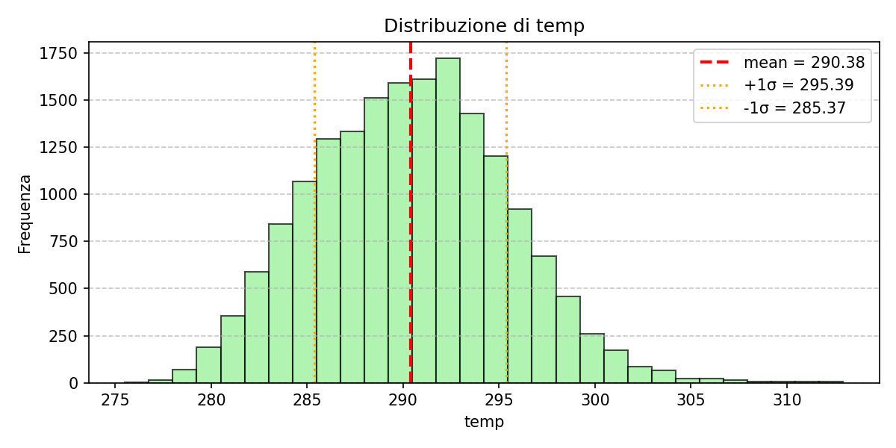
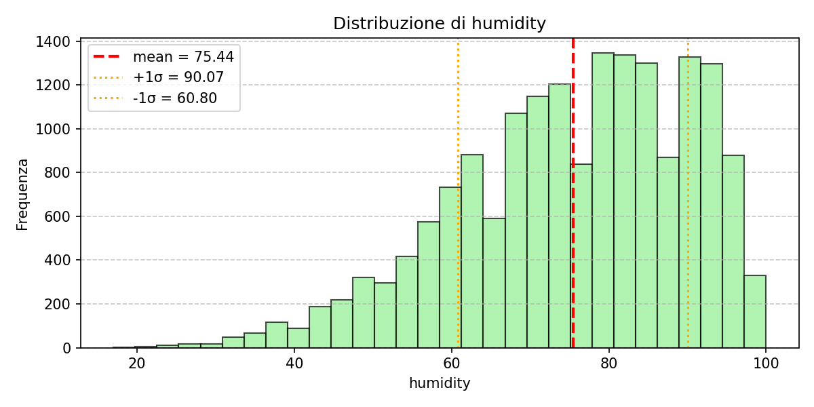

# Previsione della produzione di energia fotovoltaica

Questo progetto si propone di sviluppare un modello per prevedere la produzione di energia di un impianto fotovoltaico (PV) basandosi su dati meteorologici e altri parametri rilevanti. La previsione accurata della produzione di energia fotovoltaica è cruciale per l'ottimizzazione della gestione della rete elettrica, l'integrazione delle fonti rinnovabili e la pianificazione energetica.

Il set di dati utilizzato in questo progetto include informazioni meteorologiche come temperatura, punto di rugiada, pressione, umidità, velocità e direzione del vento, pioggia, copertura nuvolosa e descrizione del tempo, insieme a dati sulla radiazione solare (Dhi, Dni, Ghi) e la produzione di energia fotovoltaica corrispondente (kWp).

Attraverso l'analisi di questi dati, la pulizia e la preelaborazione, lo sviluppo di modelli di machine learning e la valutazione delle prestazioni, puntiamo a creare un modello di previsione robusto e affidabile.

**Obiettivi del progetto:**

*   Esplorare e comprendere la relazione tra i dati meteorologici, la radiazione solare e la produzione di energia fotovoltaica.
*   Preelaborare i dati per gestire valori mancanti, outlier e variabili categoriche.
*   Sviluppare e confrontare diversi modelli per la previsione della produzione di energia fotovoltaica.
*   Valutare le prestazioni dei modelli utilizzando metriche appropriate.
*   Fornire un modello che possa essere utilizzato per prevedere in modo affidabile la produzione di energia fotovoltaica.

Questo progetto contribuirà a una migliore comprensione dei fattori che influenzano la produzione di energia solare e fornirà uno strumento utile per la pianificazione e l'ottimizzazione dei sistemi fotovoltaici.

### Analisi Esplorativa dei Dati (EDA)  

In questa fase eseguiremo un'analisi esplorativa del dataset con l’obiettivo di comprendere la struttura, la qualità e le relazioni tra le variabili disponibili. L’EDA ci consentirà di identificare eventuali valori mancanti, outlier o anomalie nei dati, nonché di analizzare la distribuzione statistica delle variabili meteorologiche (temperatura, umidità, pressione, radiazione solare, ecc.) e la loro correlazione con la produzione di energia fotovoltaica (kWp). Verranno utilizzate tecniche di **statistica descrittiva**, **visualizzazioni grafiche** (istogrammi, boxplot, heatmap di correlazione) e **analisi temporali** per osservare l’andamento della produzione energetica rispetto alle condizioni climatiche. Questa fase fornirà una comprensione approfondita del dataset e guiderà le successive scelte di **preprocessing**, **feature engineering** e **modellazione predittiva**.

## **Osservazioni**

# Risultati sintetici EDA
- Missing: la sola variabile con vuoti rilevanti è `rain_1h` (~79%); le etichette PV non hanno missing. Per il modello imputiamo `rain_1h` a 0.
- Correlazioni numeriche con `kwp`: le componenti radiative sono le più informative (`Ghi` ≈ 0.95, `Dni` ≈ 0.79, `Dhi` ≈ 0.66), seguite da umidità e temperatura (≈0.43). Queste feature vanno conservate con attenzione.
- Categorie meteo: poche classi dominanti (`sky is clear`, `light rain`, `overcast clouds`) e molte classi rare; da qui la scelta di raggruppare e fare One-Hot Encoding con colonna `other`.
- Analisi temporale: il picco di `kwp` è concentrato nelle ore centrali del giorno, coerente con l’allineamento a fuso fisso e con i picchi di irraggiamento nei plot `eda_plots/time_series_kwp.png`.

### Visualizzazioni chiave
-   
  Oscillazione stagionale e picchi giornalieri stabili confermano che il riallineamento temporale (rimozione DST) mantiene il mezzogiorno fisico costante.
-   
  `Ghi`, `Dni` e `Dhi` sono le variabili più correlate con `kwp`; pressione e umidità hanno contributo secondario, a supporto della selezione di feature radiative.
-   
  Distribuzione ampia con coda destra: giustifica il clipping di outlier e la standardizzazione prima del modello.
-   
  Elevata variabilità della componente diretta; suggerisce l’utilità di combinare Dni con lo zenith per ridurre la varianza (vedi `effective_irradiance`).
-   
  Valori più bassi e compatti: buona per stimare la quota diffusa e per calcolare `direct_fraction`.
-  e   
  Distribuzioni quasi gaussiane con varianza moderata: scaling standard funziona bene e riduce l’impatto di unità diverse.
-   
  Distribuzione quasi uniforme: rende utile una feature continua (`cloud_effect`) invece di sole categorie meteo.
-   
  Dominata dagli zeri (79% missing imputati a 0) con coda corta: motivazione per imputazione conservativa senza creare rumore.
-  e   
  Confermano poche classi prevalenti e molte rare: scelta di raggruppare e usare OHE con bucket “other” per evitare sparsità.

# Ciclical Encoding

In questa sezione trasformiamo la colonna dt_iso per renderla digeribile dal modello, risolvendo due criticità fondamentali delle serie storiche:

**Rimozione dell'Ora Legale** (DST): abbiamo convertito tutti i timestamp in un fuso orario fisso (UTC+10 statico). Questo elimina i "salti" artificiali dell'ora legale e garantisce che il picco di irraggiamento solare avvenga sempre alla stessa ora "fisica" durante tutto l'anno, evitando che il modello veda il mezzogiorno solare oscillare tra le 12:00 e le 13:00.

**Encoding Ciclico** (Seno/Coseno): Le variabili cicliche come l'ora (0-23) e il mese (1-12) sono state trasformate in coordinate su un cerchio usando funzioni trigonometriche ($sin$ e $cos$). Questo permette alla rete neurale di comprendere correttamente la continuità temporale (es. capire che le ore 23:00 e 00:00 sono adiacenti) che andrebbe persa con una semplice rappresentazione numerica lineare.

## Feature engineering
Per migliorare le prestazioni e integrare conoscenza fisica senza introdurre artefatti (come quelli derivati dall’uso di POA senza tilt reale), sono state aggiunte due famiglie di feature:

### Solar features
| Feature           | Descrizione |
| ----------------- | ----------- |
| `solar_zenith`    | Angolo zenitale (90° = sole allo zenit), influenza la radiazione incidente. |
| `solar_azimuth`   | Direzione del sole (0° Nord, 180° Sud), distingue mattino/pomeriggio. |
| `clearness_index` | Rapporto tra GHI reale ed ETR (extraterrestrial irradiance), misura la limpidezza del cielo. |

### Effective irradiance
| Feature                | Formula                   | Significato |
| ---------------------- | ------------------------- | ----------- |
| `effective_irradiance` | `DNI * cos(zenith) + DHI` | Stima dell’energia effettivamente utile al pannello. |
| `direct_fraction`      | `DNI / (DNI + DHI)`       | Indica se prevale radiazione diretta o diffusa. |
| `clear_sky_index`      | `GHI / GHI_clear`         | Quanto la condizione reale differisce dal cielo ideale. |

Queste feature incorporano informazione fisica verificabile e sono estremamente predittive per modelli PV.

### 🌤 Atmospheric & temporal features

| Feature                  | Formula / Definizione | Significato |
| ------------------------ | --------------------- | ------------ |
| `cloud_effect`           | `GHI * (1 - clouds_all/100)` | Stima della radiazione attesa dopo aver tenuto conto della copertura nuvolosa (proxy robusta dello shading atmosferico). |
| `minutes_since_sunrise`  | differenza tra ora attuale e “alba stimata” | Indica quanto è avanzata la giornata solare (feature altamente informativa per la forma della curva PV). |
| `minutes_until_sunset`   | differenza tra “tramonto stimato” e ora attuale | Indica quanta parte della giornata solare rimane (utile per modellare la discesa della potenza). |

---

### Osservazioni

- Queste feature derivano da **combinazioni non lineari** di variabili fisiche → aggiungono informazione reale, non ridondanza.  
- `effective_irradiance`, `direct_fraction` e `clear_sky_index` rappresentano lo stato radiativo dell’atmosfera senza bisogno del tilt del pannello.  
- `cloud_effect` cattura il contributo della copertura nuvolosa sulla radiazione.  
- `minutes_since_sunrise` e `minutes_until_sunset` sono tra le feature temporali più predittive per la produzione PV, in quanto modellano la **fase della giornata solare**.  
- Complessivamente, queste feature rafforzano in modo sostanziale la capacità del modello di apprendere la dinamica giornaliera e stagionale della produzione fotovoltaica.

### Perché queste feature funzionano
- Allineamento temporale ciclico (sin/cos) + rimozione DST: riduce varianza stagionale e impedisce al modello di vedere discontinuità artificiali attorno ai cambi ora legale.
- `solar_zenith`/`solar_azimuth`/`clearness_index`: trasformano il timestamp in geometria solare misurabile, rendendo la previsione meno dipendente da pattern stagionali impliciti.
- `effective_irradiance` e `direct_fraction`: combinano Dni e Dhi in modo fisico, riducono il rumore sulle singole componenti e spiegano meglio i picchi di produzione osservati nei giorni sereni.
- `cloud_effect`: ingloba la copertura nuvolosa come attenuazione continua su GHI, più stabile delle sole etichette meteo discrete.
- `minutes_since_sunrise` e `minutes_until_sunset`: ancorano ogni istante alla fase del giorno solare, migliorando la predizione della curva PV anche al variare della durata del giorno.

## Output del preprocessing
- Dataset con feature: `data/processed/X_feat.csv`
- Target: `data/processed/y_processed.csv`

### Sistema di Split: Train/Val/Test e Cross-Validation
Il file data_module.py introduce un sistema avanzato per gestire gli split temporali, ora selezionabili tramite configurazione.

## Modalità 1 — Train/Val/Test classico

# Produce i dataset:

- X_train, X_val, X_test

- y_train, y_val, y_test

# Configurazione:

cfg.split.mode = "train_val_test"

## Modalità 2 — Cross-Validation temporale

# Produce una lista di fold del tipo:

{
  "fold": k,
  "X_train": ...,
  "X_val": ...,
  "X_test": ...
}

# Configurazione:

cfg.split.mode = "cv"

La funzione centrale è:

prepare_data_splits(X, y, mode="train_val_test" | "cv")

Lo split viene eseguito prima di OHE, feature engineering e scaling, evitando ogni forma di data leakage.

### Creazione dei DataLoader

Una volta generati gli split raw, la pipeline costruisce i DataLoader tramite:

build_dataloaders_from_splits(...)

In modalità Train/Val/Test:

Restituisce:

train_loader, val_loader, test_loader

In modalità Cross-Validation:

Restituisce una lista di:

{
  "fold": k,
  "train_loader": ...,
  "val_loader": ...,
  "test_loader": ...
}

Ogni fold è processato in isolamento, includendo:

fit del One-Hot Encoding solo sul train,

feature engineering separata,

scaling fittato solo sul train.

### Configurazioni centralizzate (config.py)

ExperimentConfig è il nuovo centro di controllo della pipeline.

Include:

PathsConfig

Percorsi:

dataset

output feature-engineered

SplitConfig

mode = "train_val_test" | "cv"

train_ratio, val_ratio

n_splits

PVDataConfig

history_hours

horizon_hours

include_future_covariates

DataloaderConfig

batch_size

num_workers

scaling_mode

ModelConfig

model_name = "lstm" | "gru"

hidden_size, num_layers, dropout

input_size e horizon aggiornati dinamicamente nel main

TrainingConfig

epochs

lr

weight_decay

patience

min_delta

### Modelli LSTM e GRU (models.py)

Sono supportati due modelli many-to-one:

✔ LSTMModel
✔ GRUModel

Entrambi:

prendono input [batch, time, features]

producono output [batch, horizon]

Il modello si costruisce con:

model = build_model(cfg.model, device)

Grazie al registry interno:

{"lstm": LSTMModel, "gru": GRUModel}

### Training modulare con Early Stopping (training.py)

Il modulo contiene:

train_one_epoch()

evaluate()

fit() con:

early stopping

best state restoration

storico train_loss e val_loss

Il training è ora completamente separato dalla pipeline di preprocessing.

### Ristrutturazione del main.py

Il file main.py ora:

Carica l’intera pipeline tramite ExperimentConfig

Applica preprocessing deterministico

Esegue lo split raw tramite prepare_data_splits

Applica:

One-Hot Encoding

Feature Engineering

Scaling
a ciascun fold in isolamento

Costruisce i DataLoader

Aggiorna dinamicamente:

cfg.model.input_size = train_dataset.X_values.shape[1]
cfg.model.horizon = train_dataset.horizon

Addestra un modello:

una sola volta (TVT)

una volta per ogni fold (CV)