# Previsione della produzione di energia fotovoltaica

Modello end-to-end per prevedere la potenza di un impianto PV a partire da dati meteo (temperatura, umidità, vento, pioggia, nuvolosità) e radiazione solare (Dhi, Dni, Ghi). La pipeline pulisce i dati, li riallinea in un fuso fisso, applica encoding ciclico e feature fisiche, quindi prepara gli split temporali e i DataLoader PyTorch.

**Obiettivi del progetto:**
- Legare variabili meteorologiche e radiazione solare alla produzione PV.
- Pulire dati (missing, outlier, categorie rare) in modo deterministico.
- Sviluppare e confrontare modelli di previsione su split temporali robusti.
- Fornire feature fisiche interpretabili riutilizzabili in altri modelli.

## Struttura dei file
- `main.py`: entrypoint della pipeline; orchestra caricamento, EDA, preprocessing, split temporali, OHE, feature engineering, scaling, standardizzazione della `y`, DataLoader e training modello Seq2Seq LSTM (encoder–decoder).
- `src/config.py`: tutte le configurazioni (percorsi dati, split, `PVDataConfig`, batch/num_workers, scaler mode, hyperparam modello, training params, path plot loss).
- `src/data_upload.py`: lettura dei file Excel grezzi (`data/wx_dataset.xlsx`, `data/pv_dataset.xlsx`) con gestione dei fogli e check sull'engine `openpyxl`.
- `src/EDA.py`: stampe di controllo e generazione dei plot EDA (`eda_plots/*.png` e `numeric_stats.csv`).
- `src/preprocessing.py`: imputazione `rain_1h`, estrazione/rimozione di lat/lon, fix timezone (UTC+10), encoding ciclico ora/mese, allineamento X-y, OHE con vocabolario fisso e scaler standard/minmax fittati sul solo train.
- `src/feature_engineering.py`: feature fisiche (angoli solari, clearness index, effective irradiance, cloud_effect, minuti da/alba/tramonto) e salvataggio delle matrici con feature.
- `src/data_module.py`: split temporali (holdout o CV), dataset a finestre per serie storiche (`history_hours`/`horizon_hours`), aggiunta del contesto al validation e DataLoader PyTorch; supporta anche l'inclusione della y passata tra le feature del modello.
- `requirements.txt`: dipendenze minime per eseguire pipeline, plot e PyTorch.
- `data/processed/*.csv`: output intermedi; il main salva sempre `X_processed.csv` e `y_processed.csv`, mentre altri file (es. `X_*_feat.csv`) possono essere presenti da esecuzioni precedenti o pipeline separate e non sono necessariamente rigenerati.
- `eda_plots/*.png`, `eda_plots/numeric_stats.csv`: grafici e statistiche descrittive prodotte dall'EDA.

## Come gira la pipeline (main.py)
1. Carica X grezze meteo e y PV (`load_datasets`), estrae lat/lon.
2. Esegue EDA base e salva i plot in `eda_plots/`.
3. Preprocessing deterministico (`preprocess_pipeline`): imputazioni, timezone fisso, encoding ciclico, allineamento, cast a `float32`.
4. Split temporale coerente (holdout o CV) senza leakage.
5. Fit OHE solo su train e applicazione a val/test.
6. Feature engineering fisico (angoli solari, effective irradiance, cloud effect, timing solare) e scaling opzionale.
7. Standardizza la `y` (mean/std calcolati sul solo train di ogni fold) per stabilizzare il training.
8. Per il validation aggiunge un contesto storico (ultime `history_hours` del train) così le finestre non partono "a vuoto".
9. Salva sempre `data/processed/X_processed.csv` e `data/processed/y_processed.csv`; i file `data/processed/X_*_feat.csv` possono derivare da esecuzioni precedenti o pipeline di preprocessing separate e non sono sempre rigenerati dal main attuale. Costruisce i DataLoader per il training PyTorch includendo, se configurato, la `y` passata dentro `x_hist`.
10. Allena un modello Seq2Seq LSTM (encoder–decoder) multi-step (horizon configurabile) con MSE e log delle loss train/val; il path `training.loss_plot_path` esiste nel config ma non è ancora utilizzato nella pipeline attuale per salvare il grafico.

## Analisi Esplorativa dei Dati (EDA)
L’EDA controlla qualità e distribuzioni delle variabili meteo e della label PV usando statistiche descrittive, istogrammi, heatmap di correlazione e boxplot per categorie. I grafici sono salvati in `eda_plots/` e riepilogati qui sotto.

### Risultati sintetici EDA
- Missing: solo `rain_1h` ha vuoti rilevanti (~79%); le etichette PV non hanno missing → imputazione a 0.
- Correlazioni con `kwp`: `Ghi` domina (≈0.95), seguono `Dni` (≈0.79) e `Dhi` (≈0.66); umidità/temperatura intorno a 0.43.
- Categorie meteo: poche classi principali (`sky is clear`, `light rain`, `overcast clouds`) e molte rare → OHE con bucket `other`.
- Analisi temporale: picchi PV nelle ore centrali, coerenti con il fuso fisso e con i picchi di irraggiamento.

### Galleria EDA (estratto)
- 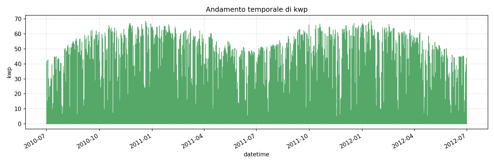 Andamento temporale stabile, conferma il riallineamento in UTC+10.
- 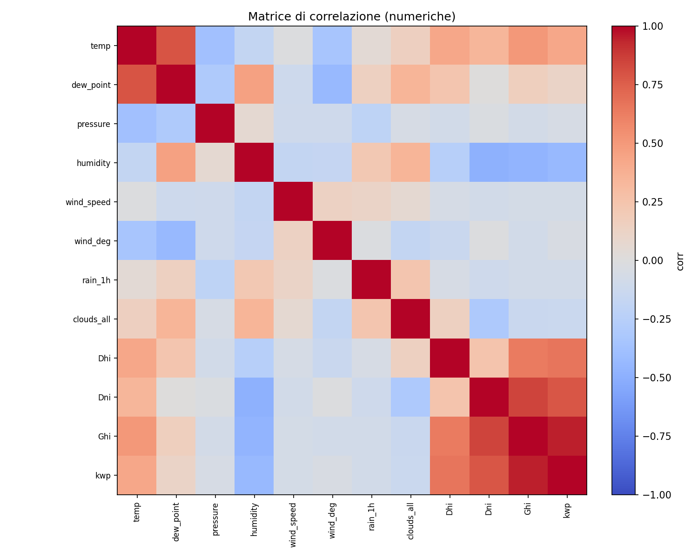 Le componenti radiative spiccano; pressione e umidità sono secondarie.
- 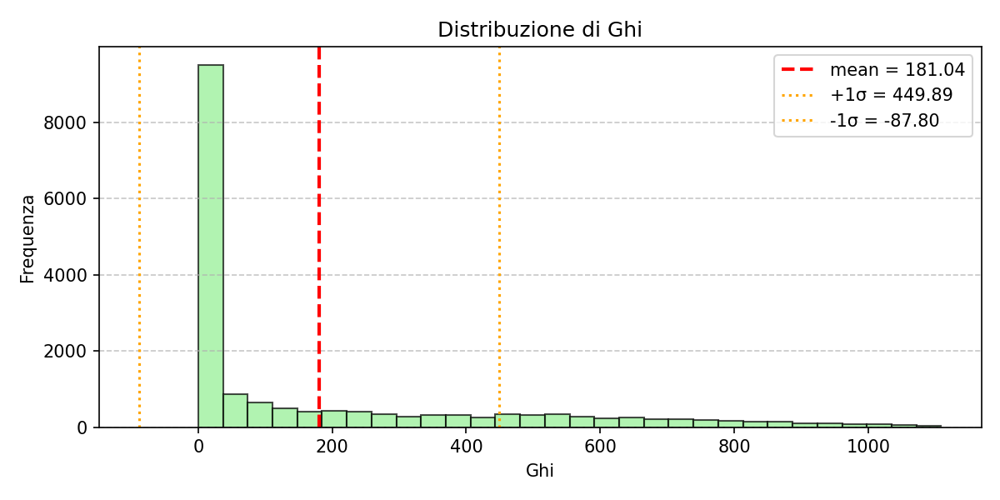 Coda destra pronunciata → utile il clipping outlier.
- 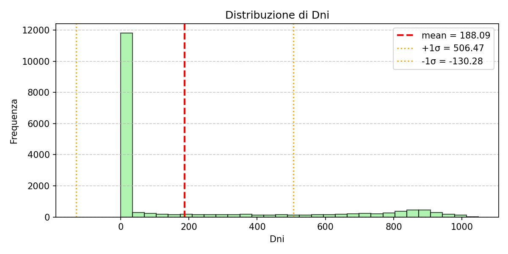 Varianza alta della componente diretta, motivazione per combinare con lo zenith.
- 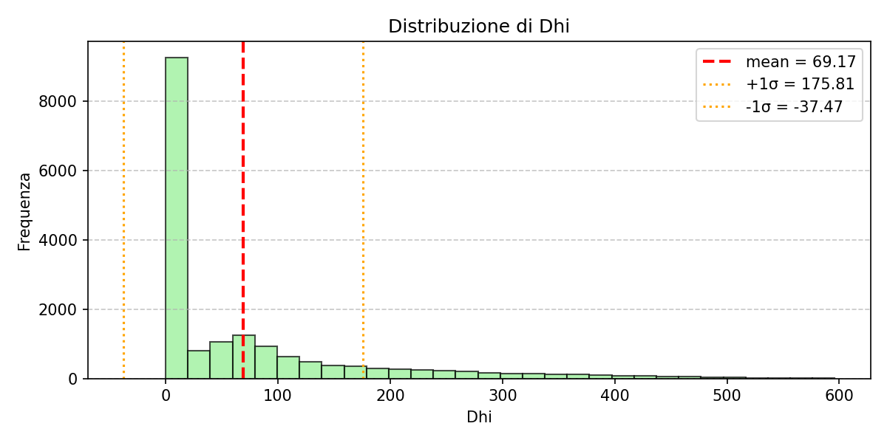 Valori compatti per la quota diffusa, base per `direct_fraction`.
- 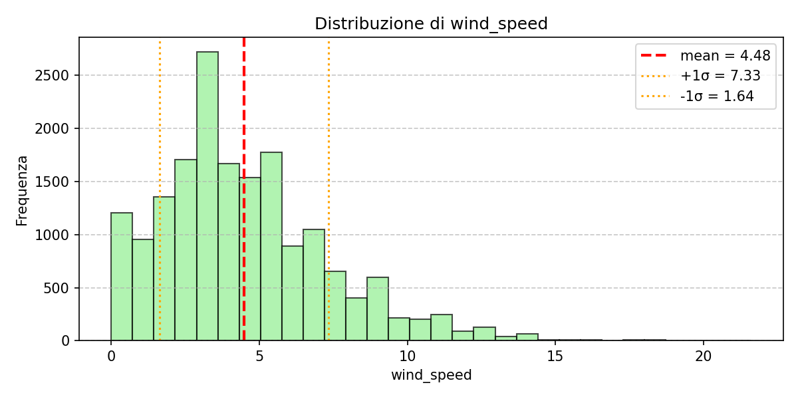 Distribuzione stretta intorno a valori moderati; impatto limitato ma stabile sul modello.
- 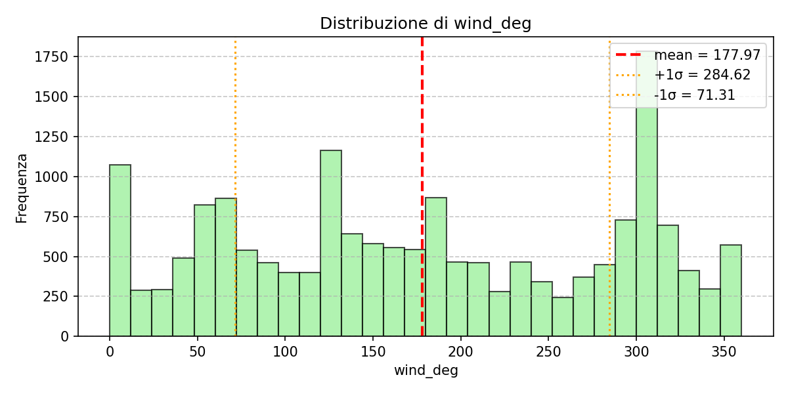 Pattern quasi uniforme → conviene lasciarla come variabile continua.
- 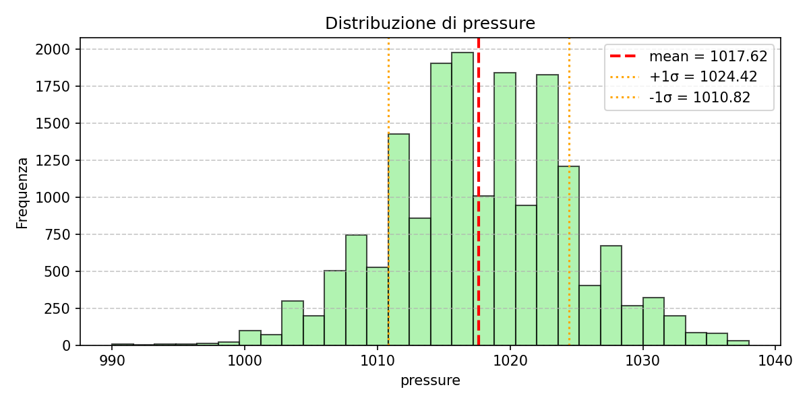 Distribuzione stretta, buon candidato per scaling standard.
- 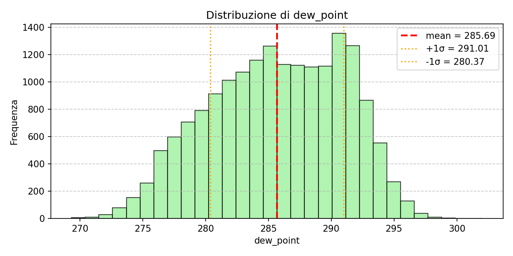 Trend quasi gaussiano che segue l’umidità, utile per capire condizioni di condensa.
- 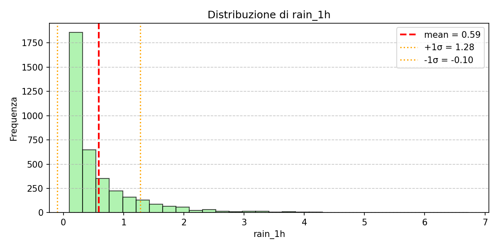 Dominata dagli zeri; l’imputazione a 0 non introduce rumore.
- 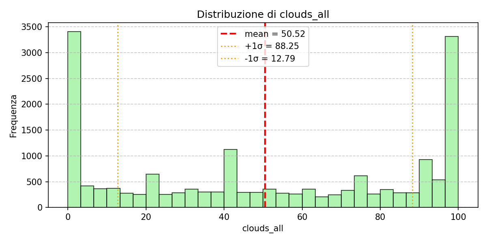 Distribuzione quasi uniforme → `cloud_effect` come attenuazione continua.
- 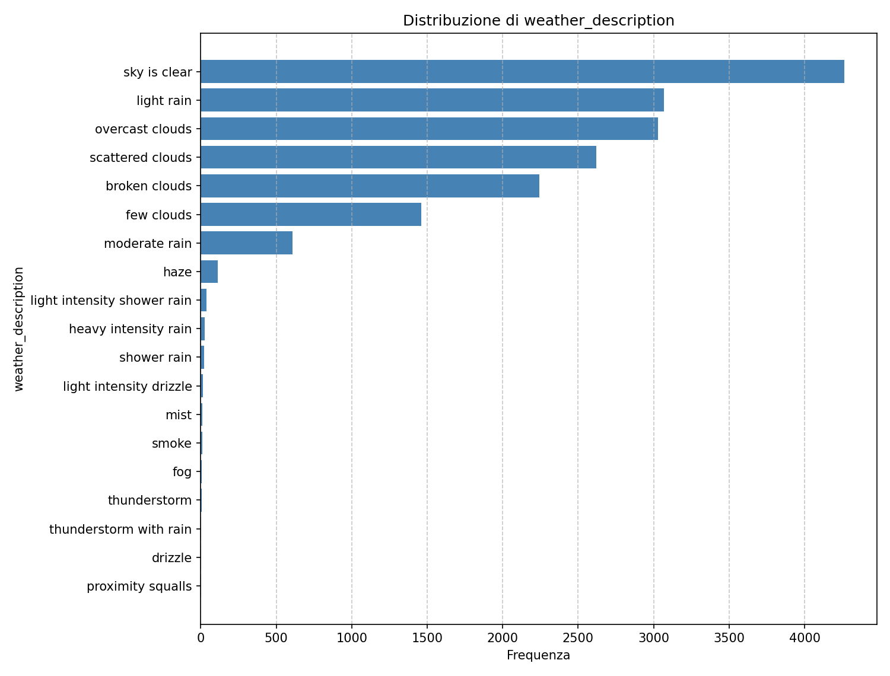 e 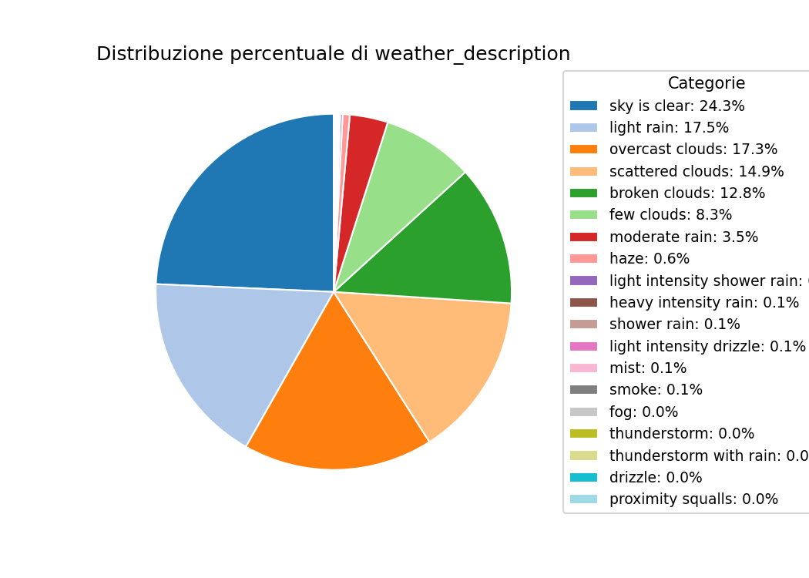 Poche classi prevalenti, molte rare: giustifica il bucket `other`.

### Analisi temporale avanzata (eda_plots/temporal)
Questi grafici servono per capire struttura, stagionalità e dipendenze della serie PV, e quindi guidare la scelta del modello e della finestra storica.

- 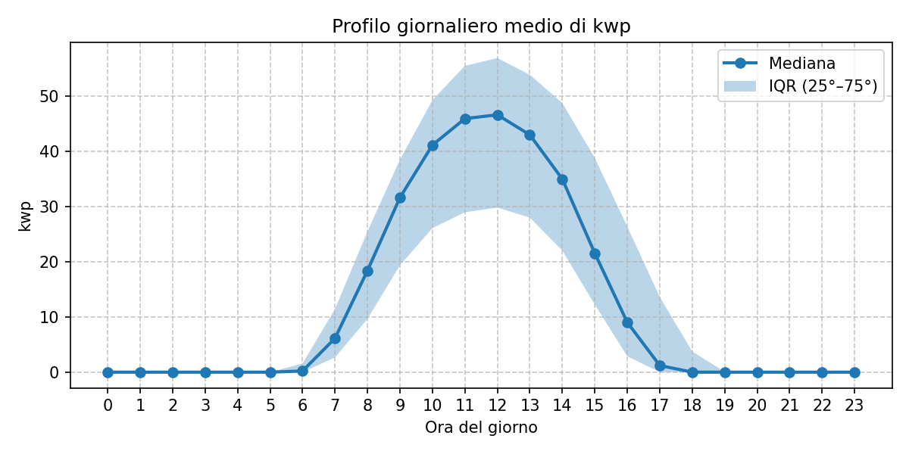 Media oraria della produzione: curva a campana con minimi notturni e picco nelle ore centrali. La pendenza di salita/discesa indica l'asimmetria mattino/pomeriggio e conferma che il segnale e dominato dal ciclo diurno → suggerisce modelli che catturano pattern intraday e finestre storiche che coprano un intero giorno.
- 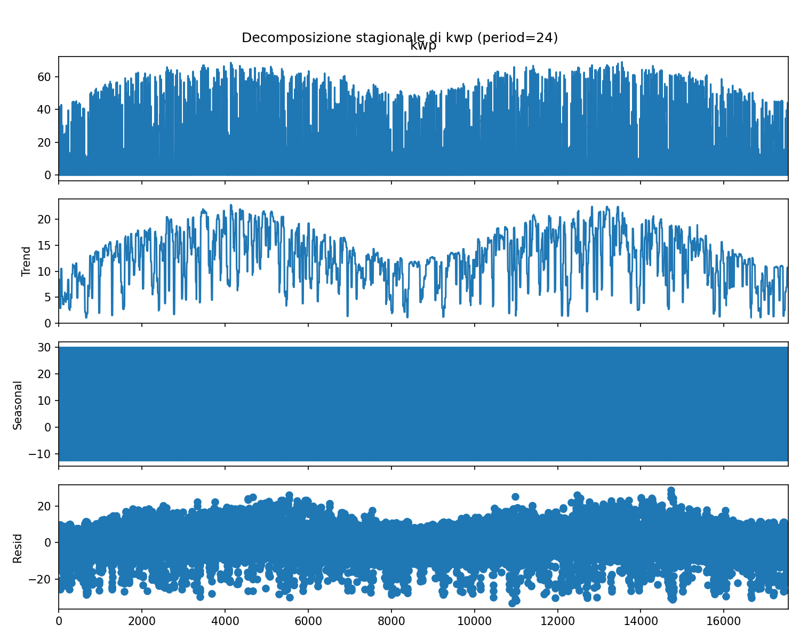 Scomposizione in trend, stagionale e residuo: il trend mostra variazioni lente (stagioni o degradazione), la componente stagionale evidenzia oscillazioni regolari, il residuo mostra rumore e eventi improvvisi (nubi) → motiva feature di calendario/cicliche e modelli capaci di separare trend da stagionalità.
- 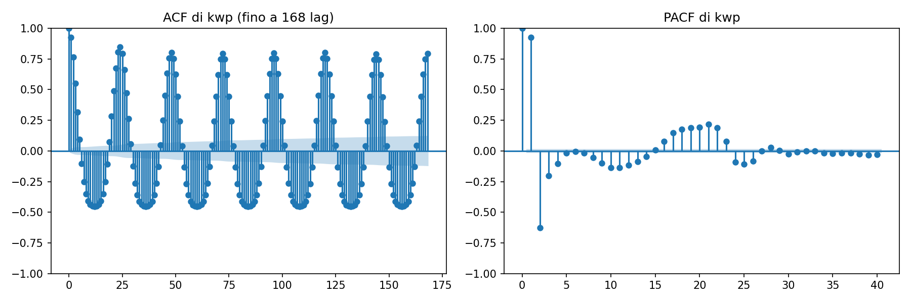 L'ACF evidenzia memoria a lag brevi e risonanze a 24h/48h; la PACF mostra i lag realmente informativi una volta tolta la dipendenza indiretta → aiuta a scegliere `history_hours`, il numero di lags utili e supporta modelli sequence-based LSTM/Seq2Seq.
- 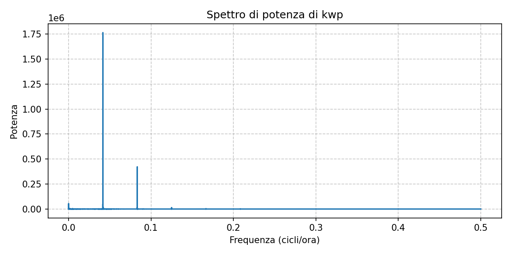 L'energia è concentrata su frequenze giornaliere (e secondariamente settimanali), con armoniche che descrivono la forma non sinusoidale del profilo PV → conferma periodicità, giustifica encoding ciclico e modelli con capacità di catturare componenti periodiche multiple.

In sintesi: la forte periodicità e l'autocorrelazione suggeriscono modelli temporali con memoria (LSTM/Seq2Seq) e una finestra storica che copra almeno il ciclo giornaliero; la stagionalità più lenta giustifica feature di calendario e split temporali rigorosi per evitare leakage.

# Ciclical Encoding
Per rendere il tempo digeribile dal modello:
- **Rimozione dell'Ora Legale (DST)**: conversione di tutti i timestamp in fuso fisso UTC+10 e arrotondamento all’ora → niente salti artificiali tra 12:00 e 13:00.
- **Encoding ciclico (sin/cos)**: ora (0-23) e mese (1-12) trasformati su cerchio per preservare la continuità (23 è vicino a 0).

## Feature engineering
Feature fisiche aggiunte per migliorare le prestazioni senza usare il tilt reale del pannello.

### Solar features
| Feature           | Descrizione |
| ----------------- | ----------- |
| `solar_zenith`    | Angolo zenitale (90° = sole allo zenit), influenza la radiazione incidente. |
| `solar_azimuth`   | Direzione del sole (0° Nord, 180° Sud), distingue mattino/pomeriggio. |
| `clearness_index` | Rapporto tra GHI reale ed ETR (extraterrestrial irradiance), misura la limpidezza del cielo. |

### Effective irradiance
| Feature                | Formula                   | Significato |
| ---------------------- | ------------------------- | ----------- |
| `effective_irradiance` | `DNI * cos(zenith) + DHI` | Stima dell’energia effettivamente utile al pannello. |
| `direct_fraction`      | `DNI / (DNI + DHI)`       | Indica se prevale radiazione diretta o diffusa. |
| `clear_sky_index`      | `GHI / GHI_clear`         | Quanto la condizione reale differisce dal cielo ideale. |

### Atmospheric & temporal features
| Feature                  | Formula / Definizione | Significato |
| ------------------------ | --------------------- | ------------ |
| `cloud_effect`           | `GHI * (1 - clouds_all/100)` | Radiazione attesa dopo l’attenuazione delle nubi (proxy dello shading atmosferico). |
| `minutes_since_sunrise`  | differenza tra ora attuale e alba stimata | Indica l’avanzamento della giornata solare. |
| `minutes_until_sunset`   | differenza tra tramonto stimato e ora attuale | Quanta parte della giornata solare rimane. |

### Osservazioni
- Le feature sono combinazioni non lineari di variabili fisiche → aggiungono informazione, non rumore.
- `effective_irradiance`, `direct_fraction` e `clear_sky_index` descrivono lo stato radiativo senza tilt.
- `cloud_effect` ingloba la copertura nuvolosa come attenuazione continua.
- `minutes_since_sunrise` e `minutes_until_sunset` modellano la fase del giorno, tra le feature più predittive per la curva PV.

## Output del preprocessing
- Dataset con feature: `data/processed/X_feat.csv` (o `X_*_feat.csv` per train/val/test). Nel main attuale non vengono generati direttamente: i file `X_*_feat.csv` presenti in `data/processed/` derivano da esecuzioni precedenti o da funzioni di preprocessing invocate separatamente.
- Target: `data/processed/y_processed.csv`.

## Note su data_module (modifiche recenti)
- **Context nel validation**: quando si costruiscono i set di val, si premettono le ultime `history_hours` del train a `X_val` e `y_val` (funzione `make_val_with_context`). Questo evita finestre iniziali senza storia e rende la validazione coerente con la dinamica autoregressiva.

## Configurazione (config.py)
- `split.mode`: seleziona lo schema di training (`train_val`, `train_all`, `cv`).  
  - `train_val`: split temporale semplice con holdout finale.  
  - `train_all`: usa tutto il train, con un piccolo blocco finale opzionale come validation.  
  - `cv`: cross-validation temporale con più fold, senza shuffle.
- `train_all_val_ratio`: usato solo in `train_all` per determinare la porzione finale riservata alla validazione mantenendo l’ordine temporale.
- `history_hours`, `horizon_hours`: definiscono rispettivamente la lunghezza della finestra storica in input e l’orizzonte di previsione multi-step (es. 72 ore di input → 24 ore di output).
- `include_past_target`: se `True`, la `y` passata (kwp) viene concatenata alle feature in `x_hist`, abilitando un forecasting autoregressivo senza leakage futuro.
- `dataloader.scaling_mode`: controlla lo scaling (`standard`, `minmax`, o `None`) fittato solo sul train e riapplicato a val/test tramite lo `scaler.pkl`.
- `random_search.enabled`: abilita/disabilita la random search su CV per l’ottimizzazione degli iperparametri, con metriche selezionabili (loss/rmse/mase).

## Valutazione e Test
`evaluate.py` carica modello, scaler e vocabolario OHE salvati in `artifacts/`, ricostruisce preprocessing e feature engineering, e valuta il modello sul foglio test.  
`cfg.test.sheet_name` indica quale sheet del dataset usare come test finale (es. un intervallo temporale non visto nel train).  
Le metriche calcolate in scala reale sono MAE, MSE, RMSE e MASE (con stagione m=24), così da confrontare errore assoluto, quadratico e relativo a una baseline stagionale naive.  
Durante la valutazione vengono generati uno o più grafici `eda_plots/pred_vs_naive_week_*.png` (fino a 4, in base alla lunghezza del periodo di test), che mostrano la predizione del modello contro la baseline naive su settimane campionate dal test.

## Dipendenze opzionali
`statsmodels` è opzionale: serve solo per ACF, PACF e decomposizione temporale nell’EDA (`src/EDA.py`). Se non è installato, quei grafici vengono saltati.

## Modello implementato – Seq2Seq LSTM
Schema del flusso:
```
x_hist -> encoder -> stato -> decoder autoregressivo -> y_hat[24]
```

`x_hist` contiene la finestra storica delle feature meteo + feature ingegnerizzate, con lunghezza `history_hours` (es. 72 ore).  
Se `include_past_target=True`, la serie storica della `y` (kwp) viene concatenata a `x_hist` lungo l’asse delle feature, così il modello vede anche l’andamento passato della potenza senza usare informazioni future.

L’encoder è un LSTM che legge l’intera sequenza `x_hist` e riassume la storia nello stato finale (h, c). Questo stato cattura pattern diurni, dinamiche meteo e trend a breve termine presenti nella finestra storica.  
Il decoder è un LSTM autoregressivo: parte da un token iniziale trainabile, poi predice un passo alla volta. A ogni step:
1) riceve come input la previsione del passo precedente,  
2) aggiorna lo stato interno,  
3) emette il valore successivo di `y_hat`.  
Il risultato è un vettore `y_hat` di lunghezza `horizon_hours` (es. 24 ore future).

### Encoder e Decoder – Funzionamento dettagliato
**ENCODER**  
L’encoder riceve in input `x_hist`, cioè la history di 72 ore con tutte le feature (meteo, radiazione e feature ingegnerizzate).  
In `src/models.py`, l’LSTM dell’encoder scorre l’intera sequenza temporale e la comprime in due stati finali: stato nascosto `h` e stato di cella `c`.  
Questi stati rappresentano un “riassunto dinamico” del passato: catturano pattern giornalieri, variazioni meteo e trend a breve termine.  
`h` e `c` vengono poi passati direttamente al decoder come punto di partenza.

**DECODER**  
Il decoder parte dallo stato finale dell’encoder (`h`, `c`) e genera le 24 ore future in modo autoregressivo, coerente con `horizon=24`.  
Ogni passo usa come input l’output del passo precedente: non c’è teacher forcing in test, ma una previsione step-by-step che riflette il comportamento reale in inferenza.  
Questo rende il decoder sensibile all’accumulo di errori, ma consente di modellare la dipendenza temporale su tutto l’orizzonte.

**FLUSSO COMPLETO**  
```
x_hist -> Encoder -> (h, c) -> Decoder autoregressivo -> y_hat[24]
```
La sequenza passa interamente attraverso l’encoder; il decoder riceve lo stato finale e genera il primo valore futuro, poi usa quel valore per produrre il secondo, e cosi' via fino al 24esimo step.  
Il risultato è una traiettoria completa delle 24 ore successive, costruita in modo consistente con la dinamica osservata nelle 72 ore precedenti.

**include_past_target**  
Quando `include_past_target=True`, la kwp passata entra dentro `x_hist` come feature aggiuntiva, ma solo per il passato.  
Non c’è leakage: l’informazione della `y` futura non viene mai fornita al modello, mentre la storia della potenza aiuta l’encoder a sintetizzare meglio il contesto.

Con `history=72` e `horizon=24`, il modello usa 3 giorni di contesto per prevedere il giorno successivo.  
Questo schema è coerente con la stagionalità giornaliera del PV e con le finestre autoregressive tipiche per la produzione oraria.

Nel training si usa una loss MSE e un loop multi-epoca (default `epochs=20`).  
È attivo l’early stopping (`early_stopping=True`, `patience=8`, `min_delta=0.0`) per fermare l’allenamento quando la metrica di validazione non migliora.  
Le metriche monitorate includono MSE e RMSE, e quando disponibile anche MASE (con m=24).  
La validazione usa `make_val_with_context`, che premette le ultime `history_hours` del train a `X_val` e `y_val`: questo evita finestre iniziali “senza storia” e garantisce che il decoder autoregressivo parta da un contesto realistico, riducendo distorsioni nelle metriche.

## Risultati e Output
Gli output vengono salvati in:
- `eda_plots/`: grafici EDA base, inclusi `pred_vs_naive_week*.png` che confrontano le predizioni del modello con una baseline naive su finestre settimanali.
- `eda_plots/temporal/`: grafici temporali (ACF, decomposizione stagionale, profilo giornaliero) utili per leggere periodicità, autocorrelazioni e pattern diurno della produzione.
- `artifacts/`: contiene i file necessari alla valutazione e al riuso del modello.
  - `model_seq2seq.pth`: pesi del modello Seq2Seq LSTM.
  - `scaler.pkl`: statistiche di scaling di X e y (fittate sul train).
  - `ohe_vocab.pkl`: vocabolario delle colonne OHE per `weather_description`.
  - `X_val_scaled.npy`, `y_val_scaled.npy`: validation set scalati (per valutazione offline).
- `data/processed/`: dataset preprocessati e/o feature-engineered (X/y allineate, feature derivate, target scalati).

Metriche in scala reale (test):
- MAE  (real): 3.6479
- MSE  (real): 50.9145
- RMSE (real): 7.1354
- MASE (m=24): 0.7638

Interpretazione sintetica:
- MAE e RMSE quantificano l’errore medio e la penalizzazione degli errori grandi in kW/kWp.
- MASE < 1 indica che il modello supera la baseline naive stagionale (m=24).

### Forecast vs Naive (settimane campionate)
Durante la valutazione `evaluate.py` genera da 1 a N grafici `eda_plots/pred_vs_naive_week_*.png`, a seconda della lunghezza del periodo di test. Di seguito ne vengono mostrati fino a 4, quando disponibili.

- 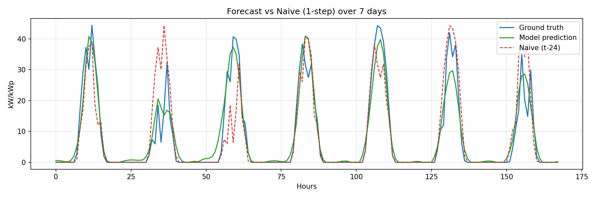
  Confronta la curva prevista con la baseline naive (t-24) su una settimana di test. Si osserva se il modello segue i picchi diurni e gli azzeramenti notturni meglio del naive; scarti sistematici sui picchi indicano under/over-estimation della produzione nelle ore centrali.

- 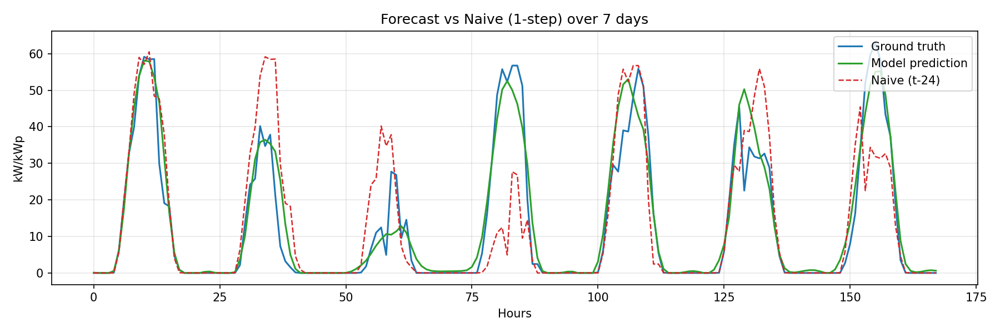
  Mostra la capacità del modello di adattarsi a variazioni giorno-per-giorno rispetto al naive. Quando la curva del modello è più vicina alla ground truth nelle transizioni alba/tramonto, l’errore assoluto tende a ridursi e contribuisce a MAE/RMSE più bassi.

- 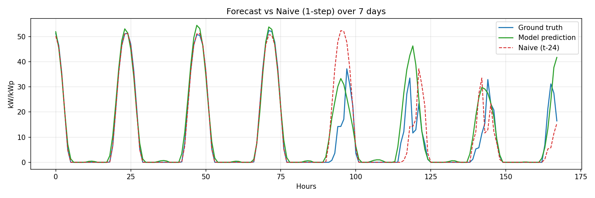
  Evidenzia eventuali errori tipici: ritardi sui picchi, smoothing eccessivo o sovrastima in condizioni nuvolose. Se il modello corregge la baseline nei giorni con profilo attenuato, migliora anche il MASE rispetto al naive.

- 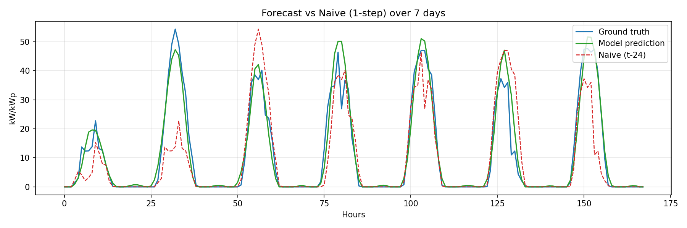
  Permette di valutare la robustezza su una finestra diversa: se il modello segue bene sia i picchi sia gli zero notturni, la distanza media dalla ground truth diminuisce e si riflette nelle metriche aggregate.

Il legame con le metriche: quando le curve del modello seguono meglio i picchi e le valli rispetto al naive, si riflette in MAE/RMSE più bassi e in un MASE < 1.  
I grafici temporali in `eda_plots/temporal/` aiutano a leggere la stagionalità giornaliera e le autocorrelazioni che il modello sfrutta per ottenere le metriche sopra.
